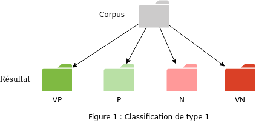
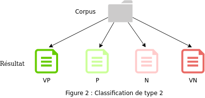
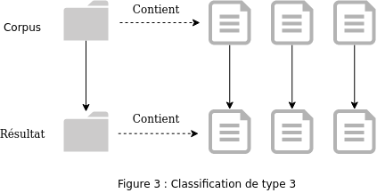

Trois classifications sont proposées :


## Classification de type 1 :

Tous les **fichiers** du dossier sont classés par sentiment dans les quatres **dossiers** respectivement appelés : VP, P, N, et VN.




## Classification de type 2 :


Toutes les **phrases** de tous les fichiers sont classées par sentiment dans des **fichiers** respectivement appelés : VP.txt, P.txt, N.txt, et VN.txt.

Note : Pour chaque fichier les phrases sont triées par valeur décroissante du sentiment de la classe.





## Classification de type 3 :


Pour chaque fichier du dossier, toutes les phrases sont classées par sentiment dans un nouveau fichier du même nom.

Note : Dans les fichiers, pour chaque classe les phrases sont triées par valeur décroissante du sentiment de la classe.



Les fichiers de sortie sont de la forme :

```
### VP
phrase 1
phrase 2
phrase 3

### P
phrase 4
phrase 5
phrase 6

### N
phrase 7
phrase 8
phrase 9

### VN
phrase 10
phrase 11
phrase 12
```
